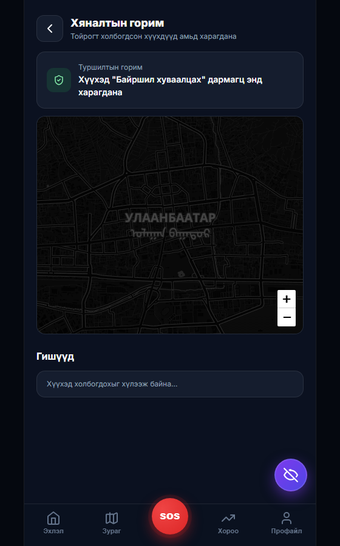
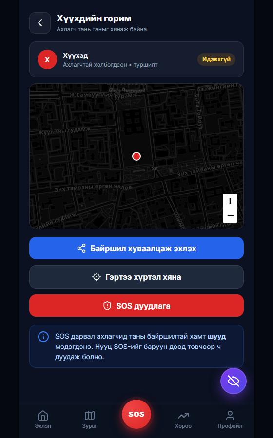
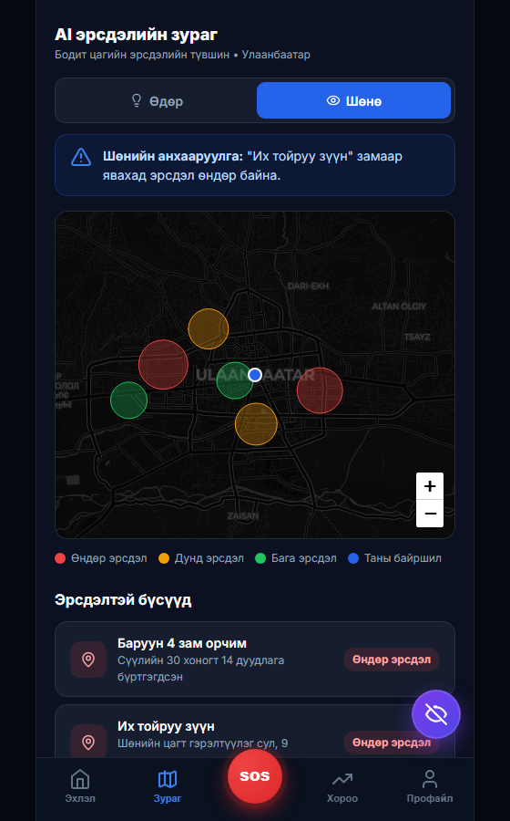
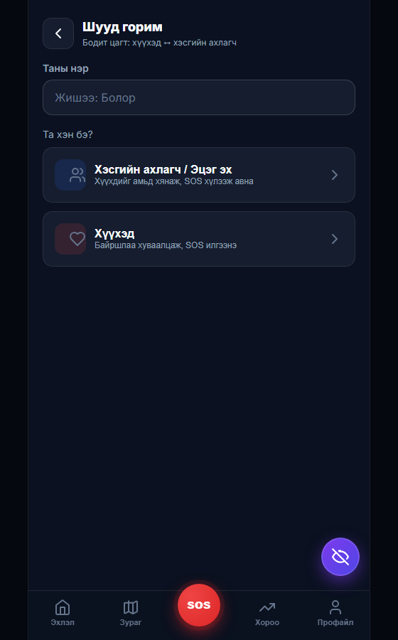
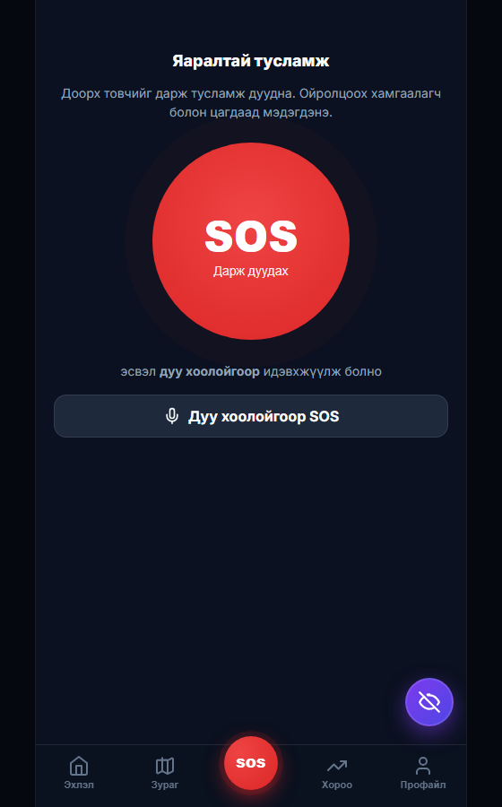

# 🛡️ Сэргийлэгч — Гарын авлага

> Иргэдийн аюулгүй байдлыг **бодит цагт** хамгаалах гар утасны апп.
> **Туршиж үзэх:** https://lha63.github.io/sergiilegch/

---

## 1. Энэ апп юу хийдэг вэ?

Сэргийлэгч нь хүүхэд, ахмад, ганцаараа явж буй иргэдийг **бодит цагт хянаж, яаралтай үед шуурхай тусламж дуудах** боломжийг олгоно.

- 📍 **Амьд байршил** — хүүхдийн байршлыг эцэг эх/хэсгийн ахлагч газрын зураг дээр бодит цагт хардаг
- 🆘 **Шуурхай SOS** — товч дарахад ойрын хүнд **байршилтай нь хамт** шууд мэдэгдэнэ (дуу + чичиргээ)
- 🧭 **Аюулгүй маршрут, эрсдэлийн зураг, аюулгүй цэг** зэрэг урьдчилан сэргийлэх хэрэгслүүд

---

## 2. Хэрхэн нээх / суулгах

Апп нь **вэб дээр шууд** ажиллана — татаж суулгах шаардлагагүй. Гэхдээ утсандаа **апп шиг** суулгаж болно:

| Төхөөрөмж | Алхам |
|-----------|-------|
| **Android (Chrome)** | Холбоосыг нээ → ⋮ цэс → **"Add to Home screen"** → 🛡️ икон гарч ирнэ |
| **iPhone (Safari)** | Холбоосыг нээ → **Share (↑)** → **"Add to Home Screen"** |

Суулгасны дараа жинхэнэ апп шиг бүтэн дэлгэцээр нээгдэнэ.

> Холбоос: **https://lha63.github.io/sergiilegch/**

---

## 3. Эхлэх — "Шууд горим"

Апп нээгдмэгц **роль** сонгоно: **Хэсгийн ахлагч / Эцэг эх** эсвэл **Хүүхэд**.

1. Нэрээ оруул
2. Ролиа сонго

---

## 4. Хэсгийн ахлагч / Эцэг эх талд

1. **"Хэсгийн ахлагч / Эцэг эх"** сонгоно
2. Хүүхэд байршлаа хуваалцмагц газрын зураг дээр **амьд харагдана** — байршил, батерей, төлөв
3. Хүүхэд SOS дарвал **бүтэн дэлгэцээр улаан анхааруулга + дуу + чичиргээ** ирнэ → "Хүлээн авлаа" дарж шийдвэрлэнэ

> 🧪 *Туршилтын горимд* хүүхэд, ахлагч хоёр **автоматаар холбогдоно** (код шаардахгүй). Жинхэнэ хувилбарт хувийн **холбох код**-оор зөвхөн өөрийн гэр бүлтэй холбогдоно.

---

## 5. Хүүхэд талд

1. **"Хүүхэд"** сонгоно
2. **"Байршил хуваалцаж эхлэх"** → ахлагчтай **шууд холбогдож**, таныг хянаж эхэлнэ
3. **SOS дуудлага** — аюул тулгарвал товч дарж тусламж дуудна
4. **"Гэртээ хүртэл хяна"** — аялах үед ахлагч таныг дагаж, аюулгүй хүрэхэд мэдэгдэнэ

> Баруун доод буланд **нууц SOS** товч — утсаа гаргахгүйгээр чимээгүй дохио өгнө.

---

## 6. Урьдчилан сэргийлэх боломжууд

Доод цэс болон үндсэн дэлгэцээс нэмэлт хэрэгслүүд рүү ханднa:

- 🗺️ **AI эрсдэлийн зураг** — өдөр/шөнийн эрсдэлтэй бүсүүд
- 🧭 **Аюулгүй маршрут** — хамгийн богино биш, хамгийн аюулгүй зам
- 🏥 **Аюулгүй цэгүүд** — 24/7 эмийн сан, цагдаа, эмнэлэг
- 📈 **Хорооны оноо**, 📷 **AI камерын анализ**, ❤️ **Гэр бүлийн тойрог** г.м.

---

## 7. Яаралтай тусламж — SOS

Том SOS товчийг дарахад ойрын хамгаалагч болон цагдаад байршилтай нь хамт мэдэгдэнэ.

---

## 8. Хэрхэн туршиж үзэх вэ?

**Компьютер дээр хурдан тест (2 цонх):**
1. Энгийн цонхоор сайт нээ → нэр → **Хэсгийн ахлагч** (хүлээнэ)
2. Нэвтрэхгүй (incognito) цонхоор сайт нээ → нэр → **Хүүхэд**
3. Хүүхэд **"Байршил хуваалцах"** → ахлагчийн зураг дээр цэг **шууд** гарна; **SOS** → ахлагчид шууд дохио

**2 утсаар бодит тест:**
1. 2 утсанд сайтыг нээж "Add to Home screen"
2. Нэг утас **Ахлагч**, нөгөө нь **Хүүхэд** болж сонгоно (код хэрэггүй)
3. Хүүхэд алхах үед ахлагчид **амьд хөдөлж** харагдана; SOS шууд ирнэ

> 📍 Байршил асуухад **Allow** дарна. iPhone дээр: Settings → Location Services → Safari зөвшөөрөлтэй байх ёстой.

---

## 9. Техникийн товч мэдээлэл

- **Бодит цаг:** Google Firebase (Firestore realtime) — хүүхэд ↔ ахлагч хооронд агшин зуурын синк
- **Платформ:** PWA — Android, iPhone, компьютер бүгд дээр; татаж суулгахгүйгээр
- **Нууцлал:** байршил зөвхөн зөвшөөрсөн тойрогт; нэвтрэлт нэргүй (anonymous), өгөгдөл шифрлэгдсэн сувгаар
- **Зардал:** одоогийн туршилт бүрэн **үнэгүй** дэд бүтэц дээр

---

## 10. Цаашид нэмэх боломжтой

- 📲 Утас түгжээтэй/апп хаалттай үед ч SOS push мэдэгдэл (Capacitor APK)
- 🔔 Geofence — "сургуульдаа хүрлээ", "эрсдэлтэй бүсэд оров" автомат мэдэгдэл
- 🚓 Цагдаа/хорооны удирдлагын самбар (dashboard), статистик
- 🤖 AI камер, эрсдэлийн таамаглалыг бодит өгөгдөлд холбох

---

*Сэргийлэгч • Иргэдийн аюулгүй байдлын апп • https://lha63.github.io/sergiilegch/*
